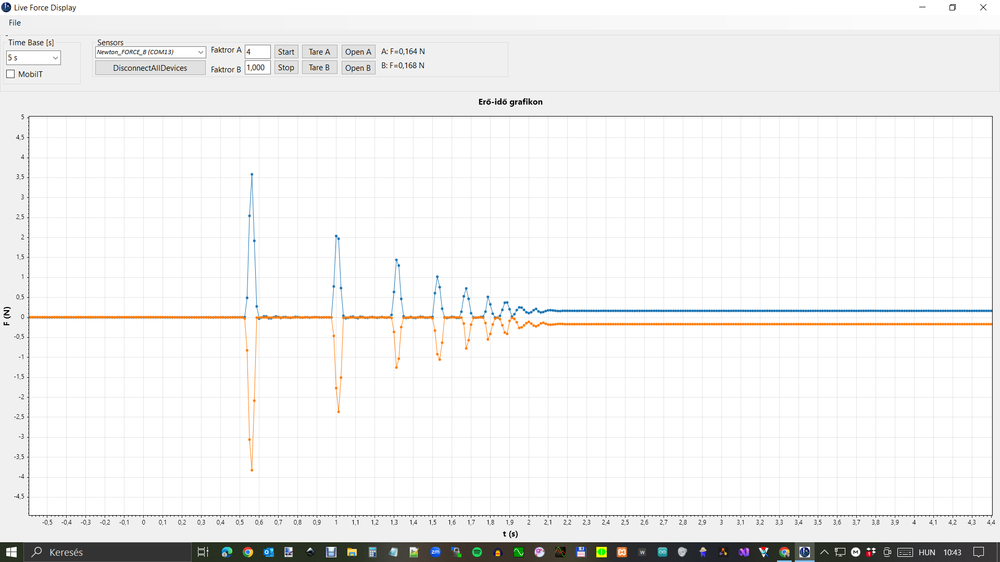

# Newton 3 – Force and Accelerometer Lab

Educational C# Windows Forms application for classroom physics experiments.

The software visualizes:

- force
- reaction force
- smartphone accelerometer data

in real time.

Its main goal is to demonstrate Newton’s third law and acceleration measurements in a simple classroom environment.

---

## Main features

✔ real-time graph display

✔ two force channels

✔ smartphone accelerometer integration

✔ measurement reset / clear graph

✔ suitable for physics classroom demonstrations

---

## Typical experiments

- Newton’s third law (force / reaction force)
- pulling and pushing
- collision experiments
- acceleration vs force
- smartphone motion measurements

---

## Screenshot

## Operating modes

Newton 3 Lab supports two main measurement modes.

### 1. Force sensor mode

In this mode the software connects to one or two Bluetooth force sensors through a virtual COM port.

The sensors transmit force data in real time, which is displayed on the graph.

Typical classroom use:

- demonstrating Newton’s third law
- force and reaction force comparison
- pulling and pushing experiments
- collision experiments
- short impulse measurements

### 2. Smartphone accelerometer mode

The software can also receive acceleration data from a smartphone.

The phone’s built-in accelerometer sends real-time data wirelessly to the PC application.

The measured acceleration is displayed as a live graph.

Typical use:

- motion experiments
- acceleration measurements
- vibration analysis
- impact measurements
- classroom use of mobile sensors

### Combined mode

Both modes can be used together.

For example, during a cart experiment the force sensor measures interaction forces while the smartphone records acceleration.

This allows students to compare measured force and acceleration directly and helps demonstrate Newton’s laws in practice.
